# Я научил языковую модель играть в «Змейку». Она проиграла алгоритму — и вот чему это учит

> **TL;DR:** Всё началось с хайпа вокруг так называемых «System 1 Decision Models» (Jev от TypeSafe и открытой Laya от Convai на ModernBERT). Создатели утверждали, что энкодеры могут молниеносно управлять играми от Doom до Змейки, выдавая вероятности действий без галлюцинаций. Но в статьях не было ни строчки реального кода — только моки и скриншоты. Я решил проверить концепцию на практике: обучил трансформер ModernBERT-base (149M) на JSON-состояниях игры, столкнулся с ковариационным сдвигом, написал DAgger, упаковал модель в 71 МБ INT4 ONNX WebGPU со сжатием словаря в 170 раз и прикрутил симуляторный «Щит» (Safety Shield) в духе AlphaZero. Теперь эта нейросеть летает прямо в браузере на WebGPU без сервера, и вы можете сыграть против неё в 3D-дуэли.

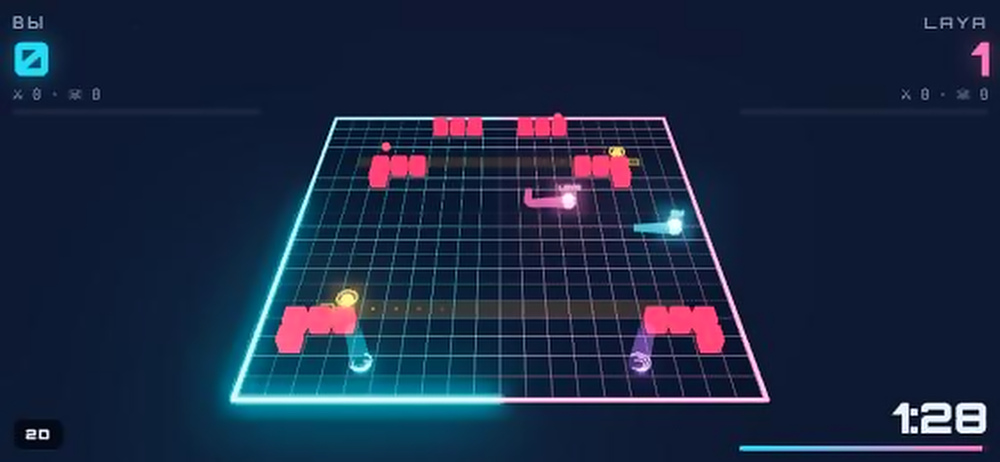

---

## 1. Начало: где код, Лебовски?

Змейка дошла до левого края поля и начала нарезать круги в углу. Яблоко лежало в десяти клетках справа. Нейросеть, которая на тестах угадывала правильный ход в 98% случаев, с непоколебимой уверенностью 99% вела её прямо в бетонную стену.

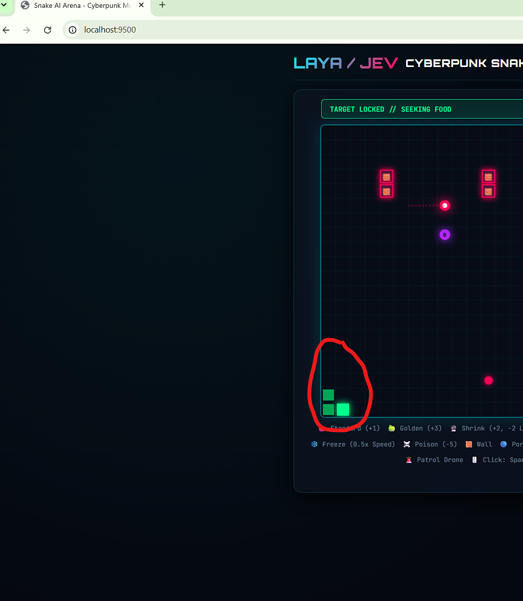

Причина оказалась в банальном порядке ключей в JSON. Это была лишь первая из серии грабель, которые научили меня реальному устройству языковых моделей глубже, чем месяцы чтения препринтов на arXiv.

Всё началось с шума вокруг **Jev** — закрытой «модели решений» от TypeSafe. Идея позиционировалась как System 1-мышление (по Даниэлю Канеману): вместо того чтобы генерировать длинную простыню текста с рассуждениями, модели скармливают текущее состояние и варианты выбора, а она возвращает массив вероятностей по классам за один прямой проход. В соцсетях и статьях замелькали эффектные скриншоты: «Нейросеть управляет Змейкой!», «Нейросеть играет в Doom!». Но когда я полез искать технические подробности — выяснилось, что открытого кода нет. Первая тестовая интеграция работала через закрытый API OpenRouter: **~400 миллисекунд сетевой задержки на каждый ход** и оплата за каждый тик игры.

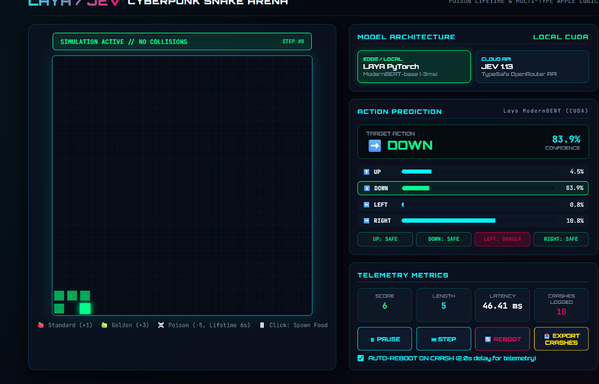

Почти сразу Convai Innovations выкатили открытую альтернативу — **Laya** под лицензией Apache 2.0. Тот же принцип классификационной головы поверх новейшего энкодера *ModernBERT-large* (421 млн параметров). Идея зацепила: если решения принимает не тяжелая 70B LLM, а шустрый двунаправленный энкодер, его можно дообучить локально под конкретную среду и запустить прямо у себя! Я взял энкодер того же семейства — **ModernBERT-base на 149 млн параметров** — и начал учить его играть в «Змейку».

*Спойлер:* в финале наша Laya уворачивается от патрульных дронов, проходит сквозь мерцающие фазовые стены, соревнуется с человеком в 3D-дуэли в браузере и весит всего **71 МБ**. И при этом… в пух и прах проигрывает классическому поиску в ширину (BFS), который вычисляет идеальный ход за **0,3 миллисекунды** на процессоре. Эта статья — честная анатомия того, что происходит, когда трансформер заставляют решать задачу, для которой он органически не предназначен.

---

## 2. Мир как текст: игровое поле в JSON

Любую систему можно описать словами — на этом держится половина современных AI-агентов, робототехники и LLM-пайплайнов. Игра здесь не исключение. На каждом шаге поле 20×20 сериализуется в JSON-документ длиной примерно 340 токенов:

```json
{
  "current_dir": "RIGHT",
  "recent_actions": ["UP", "RIGHT", "RIGHT", "RIGHT", "RIGHT"],
  "food_dir": "DOWN_RIGHT",
  "danger_UP": false,
  "danger_DOWN": false,
  "danger_LEFT": true,
  "danger_RIGHT": false,
  "head_pos": [9, 8],
  "body": [[8, 8], [7, 8], [7, 9]],
  "food_pos": [13, 12],
  "snake_len": 4,
  "immortal_steps": 0,
  "obstacles": [[4, 13], [4, 14]],
  "phase_walls": [[10, 1, 12]],
  "patrols": [[12, 7, 1, 0]],
  "drone_path": [[[13, 7], [14, 7], [15, 7], [16, 7], [17, 7], [17, 8]]]
}
```

Дальше задача сводится к обычной классификации текста. Вместо классического *«отзыв положительный или отрицательный»* модель предсказывает 4 класса: `UP`, `DOWN`, `LEFT`, `RIGHT`. Модель получает токенизированную строку, прогоняет через 22 слоя трансформера и снимает логиты с пулинга [CLS]-токена.

---

## 3. Урок 1. Формат входа — это часть модели

Вернемся к змейке, которая самоубивалась в углу. На тестовой выборке точность составляла 98,2%. Но при запуске в реальной игре змейка на 15-м ходу уперлась в левую стену и начала циклически биться о неё головой, пока не погибла.

Я вывел в консоль сырой текст, который отправлял браузер, и сравнил его со строками из обучающего датасета Python:
* В игре ключи в JSON сериализовались в порядке свойств JavaScript объекта, а в Python — в алфавитном;
* В игре отсутствующие координаты обозначались строкой `"NONE"`, а генератор датасета писал `"UNKNOWN"`;
* В игре присутствовали два лишних поля телеметрии рендера.

Для человека семантика JSON абсолютно одинакова. Но для весов трансформера с позиционными эмбеддингами RoPE это **совершенно чужой текст**, сдвинутый по фазе токенов. 

```
Формат JavaScript-интерфейса:  ↓ ← ↑ ↑ ↑ ↑ ↑ ↑ ↑ ↑ ↑ ↑ ↑ ↑ ↑ ↑ (ползёт вдоль стены в угол)
Формат обучающего датасета:   → → → → → → → → → → → → → → яблоко (уверенно идёт к еде)
```

В незнакомой ситуации модель просто откатилась к наиболее частотному паттерну из обучающей выборки — обходу поля по периметру в условиях плохой видимости.

> **💡 Вывод для продакшена:** Если вы дообучаете модель на структурированных данных (логах, тикетах, состояниях микросервисов), **схема сериализации должна версионироваться и распространяться строго вместе с весами модели**. В нашем репозитории появился файл `state_schema.json` и жесткий e2e-тест: 400 случайных игровых миров прогоняются параллельно в Python-симуляторе и JavaScript-движке, и 21 000 состояний верифицируются на побайтовое совпадение строк.

---

## 4. Архитектура: от симулятора до WebGPU

Чтобы проект не превратился в медленную игрушку с постоянными обращениями к бэкенду, архитектура была разделена на два независимых тракта с идентичными весами:

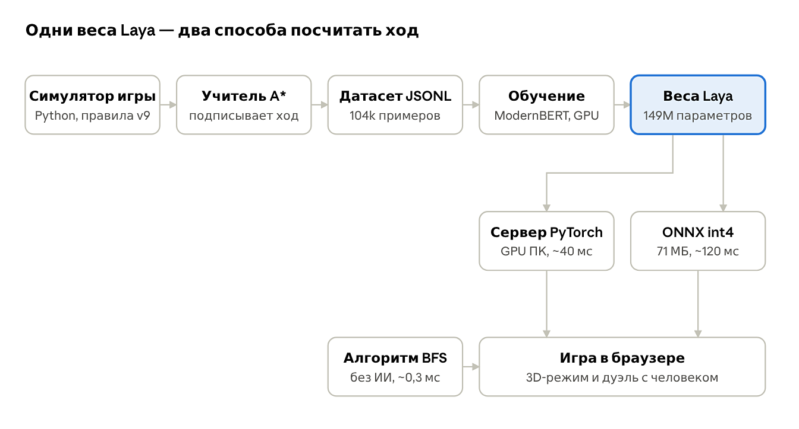

Во время обучения Python-раннер симулирует 64 параллельных мира на GPU. Для игры на клиенте модель квантуется, конвертируется в ONNX Runtime Web и исполняется через шейдеры WebGPU прямо на видеокарте пользователя без единого сетевого запроса к серверу.

---

## 5. Урок 2. Модель не выучит то, чего не видит

На следующем этапе в игру были добавлены препятствия: мерцающие стены и патрульные дроны. Змейка внезапно стала «суицидально смелой»: она уворачивалась от дрона лишь в 2 случаях из 10. Я провел вскрытие 16 смертей подряд. **Ни в одной из них змейка не врезалась в дрон головой.** Все 16 раз дрон налетал с фланга и сносил ей середину туловища или хвост!

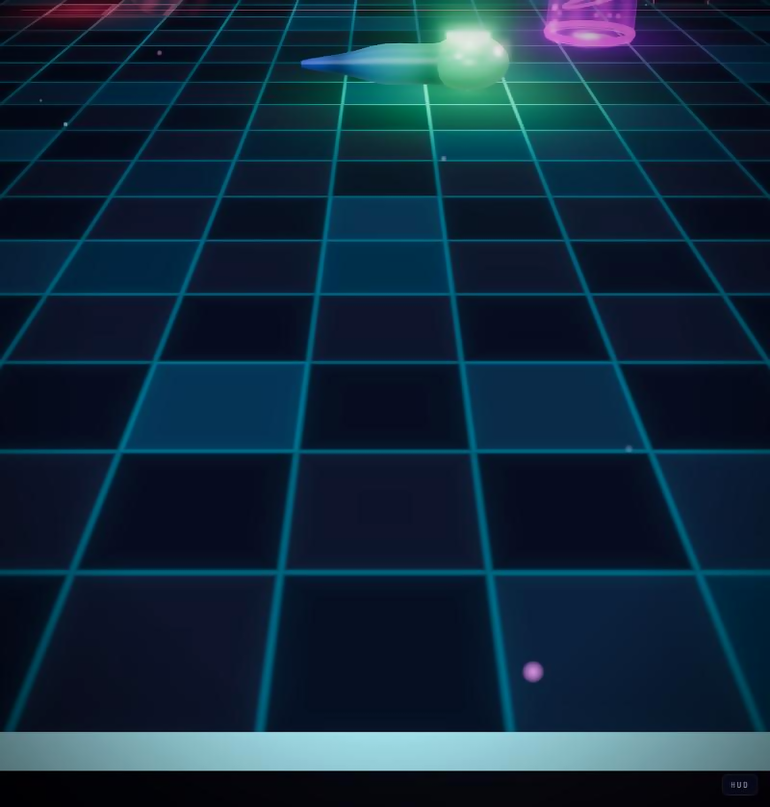

А в JSON-состоянии тела змейки… не было! Там были лишь координаты головы и флажки `danger_UP / danger_DOWN` для соседних 4 клеток. Учитель сворачивал за 4 шага до столкновения, рассчитывая траекторию своего хвоста. А модель получала абсолютно одинаковый JSON как в безопасной ситуации, так и за секунду до удара в корпус. Для нейросети это был неразличимый шум, и она честно оптимизировала самое частое действие: *«жми прямо к яблоку»*.

> **⚠️ Ловушка метрики точности:** Общая точность модели составляла впечатляющие **91,7%**. Но на редких ходах уклонения точность падала до **26%**: в 72% случаев модель упрямо перла под дрон. Критичные решения составляли всего 8% выборки, и средняя метрика их полностью маскировала!

**Решение:** мы добавили в контекст полный массив сегментов тела и предсказанные координаты движения дронов на 6 шагов вперед, а также применили 4-кратный оверсемплинг критических ситуаций уклонения. Точность на уклонениях подскочила с 26% до 54%, а средняя продолжительность жизни змейки выросла почти в три раза.

---

## 6. Врезка: Окно 11×11 и эгоцентричное зрение

Оригинальная Laya обучалась исключительно на сетке 20×20. Что произойдет, если запустить её на полях 15×15 или 25×25?

На поле 15×15 змейка в 15% партий врезалась в край поля: она ожидала свободное пространство там, где сетка уже кончилась. На поле 25×25 учитель легко увеличил среднюю партию со 199 до 267 ходов, а трансформер топтался на месте (рост всего с 89 до 107 ходов). А на поле 50×50 или бесконечной плоскости абсолютные координаты ломаются окончательно: контекст раздувается свыше лимита токенов.

Выход — **эгоцентрическое описание мира** (как в робототехнике и беспилотных автомобилях). Вместо глобальной карты модель видит плавающее окно 11×11 вокруг собственной головы в координатах «относительно меня» (*«еда: 3 клетки вправо, 2 вверх; стена: 1 клетка слева»*).

| Размер поля | Laya v10 (вся карта) | Laya v11w (окно 11×11) | Учитель (A*) | Смерти в стену (v10 vs v11w) |
|---|---|---|---|---|
| **15×15 (тесное)** | 36 ходов / 27% очков | **88 ходов / 49% очков** | 142 хода | 15% vs **0%** |
| **20×20 (родное)** | 127 ходов / 44% очков | **145 ходов / 68% очков** | 236 ходов | 0% vs **0%** |
| **25×25 (просторное)** | 107 ходов / 37% очков | **162 ходов / 62% очков** | 267 ходов | 2% vs **0%** |
| **50×50 (гигантское)** | Обрезание токенов (краш) | **174 хода / 60% очков** | 310 ходов | Краш vs **0%** |

Эгоцентрическое окно 11×11 сработало лучше даже на «родном» поле 20×20: модели трансформера намного проще распарсить токен `"wall_left": true`, чем вычитать координаты головы из координат стены через матричное умножение весов.

---

## 7. Урок 3. Ошибки катятся снежным комом (DAgger)

После исправлений точность предсказания ходов учителя на валидации достигла солидных 90,0%. Казалось бы, в игре модель должна дышать учителю в спину. Реальность оказалась жестокой: учитель жил в среднем **268 ходов**, а модель гибла уже на **117-м шаге**.

Это классическая проблема Imitation Learning — **ковариационный сдвиг (covariate shift)**. Эксперт играет идеально и никогда не оказывается в патовых ситуациях (зажат в углу, окружен дронами). Модель видит только идеальные траектории. Но стоит модели сделать *всего одну* ошибку с вероятностью 5%, как она попадает в непривычное состояние, где никогда не была. Там она паникует и неизбежно погибает через пару тактов.

Лекарство от этой беды — алгоритм **DAgger (Dataset Aggregation)**:
1. Модель сама играет партии в симуляторе;
2. В каждом шаге, в который она забрела, учитель комментирует: *«В этой передряге надо было идти сюда»*;
3. Ошибочные состояния и верные выходы из них подмешиваются в обучающий датасет для следующей эпохи.

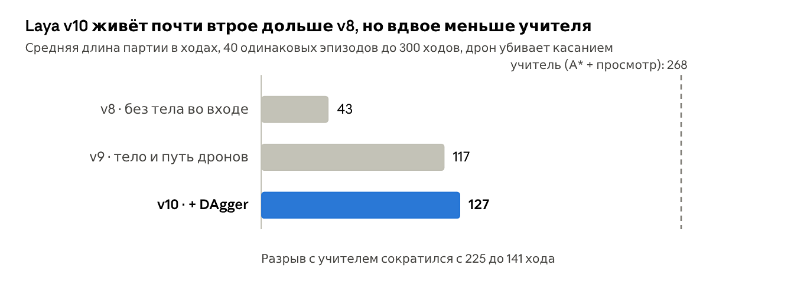

Первый раунд DAgger дал 364 партии и 263 смерти — эти критические ситуации взвинтили успешные уклонения с 54% до 64%. Второй раунд подтянул среднюю партию до 127 ходов. Ошибки перестали расти лавиной.

---

## 8. Урок 4. 296 токенов из 50 тысяч (Квантизация INT4)

Цель: запустить модель прямо в браузере любого пользователя через WebGPU. Но исходный ModernBERT в формате FP32 весит **599 МБ** — никто не будет ждать загрузки полугигабайтного файла ради казуальной игры.

Словарь ModernBERT рассчитан на все языки мира и насчитывает 50 280 токенов. А наш игровой JSON использует ровно **296 уникальных токенов** (скобки, цифры, имена полей и команды). Мы обрезали матрицу эмбеддингов до 296 строк, выбросив 99,4% словаря! Это мгновенно сэкономило десятки мегабайт без потери единого бита полезной информации.

Затем мы применили блочную квантизацию в 4 бита (INT4 с размером блока 32 веса):

| Формат весов | Размер файла | Совпадение ходов с FP32 | Время инференса (WebGPU) |
|---|---|---|---|
| **Исходник FP32** | 599 МБ | 100% (эталон) | ~240 мс (тяжело для браузера) |
| **INT8 (стандартный)** | 151 МБ | 91–95% | ~160 мс |
| **INT4 (блочный)** | 225 МБ | 94–98% | ~130 мс |
| **INT4 + урезанный словарь** | **71 МБ** | **~97%** | **~120 мс (комфортно)** |

> **⚠️ Скрытый дефект INT8:** Обычная INT8-квантизация на тестах давала 95% совпадения. Но при детальном разборе выяснилось, что именно в моменты максимальной опасности (когда вероятности распределены 49% на 51%), округление весов переворачивало знак — и модель гибла вдвое чаще. Блочный INT4 с индивидуальным масштабированием каждых 32 весов сохранил нюансы логитов гораздо точнее.

---

## 9. Человек против Машины: Арена дуэли

Чтобы протестировать поведение модели против непредсказуемого соперника, мы создали режим «Дуэль»: две змейки на одной симметричной арене (игрок — неоновый голубой, Laya — кибер-розовый), таймер на 600 ходов, мерцающие стены и патрульные дроны.

Самое интересное: **Laya вообще не переобучалась для мультиплеера**. В её обучающем датасете никогда не было второй змейки! Мы просто спроецировали тело живого противника в JSON как статическое препятствие, а клетку перед его носом пометили как зону экстремальной опасности. Модель мгновенно адаптировалась без единой строчки дообучения.

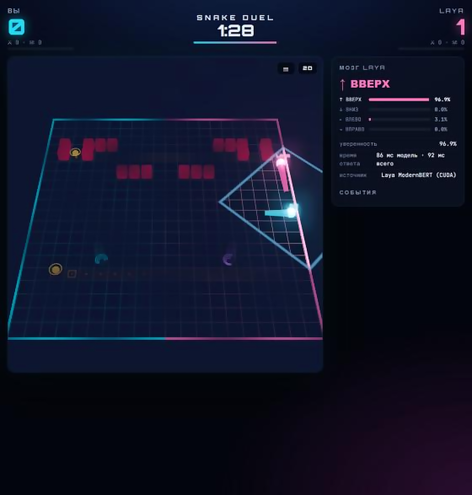

В дуэли периодически активируется *«туман войны»*: радиус обзора падает до 5 клеток. И здесь живой игрок легко громит нейросеть. Человек держит в рабочей памяти: *«Три секунды назад в правом углу появилось золотое яблоко за +3 очка»* — и целенаправленно ползет туда через слепую зону. Laya же помнит лишь последние 5 своих шагов, и в тумане начинает хаотично блуждать. Модель без долговременной памяти воспринимает каждый тик как начало вселенной.

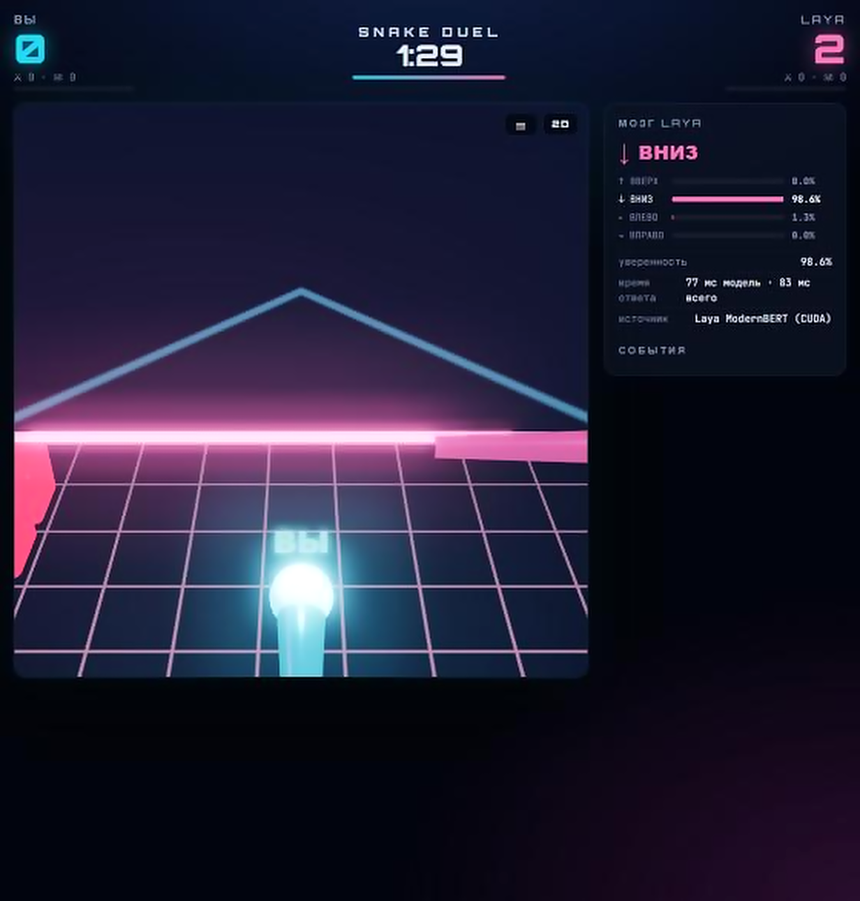

| 3D Web-арена на смартфоне | Мобильный интерфейс дуэли со свайпами |
|---|---|
| 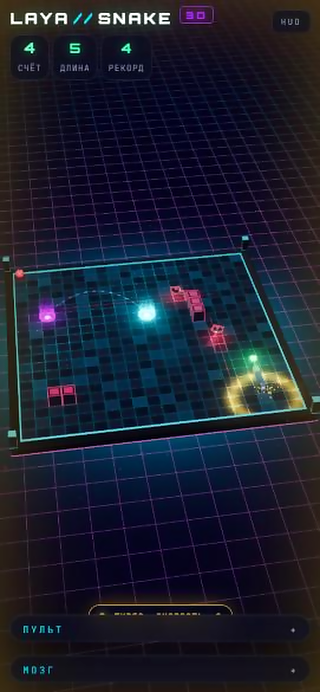 | 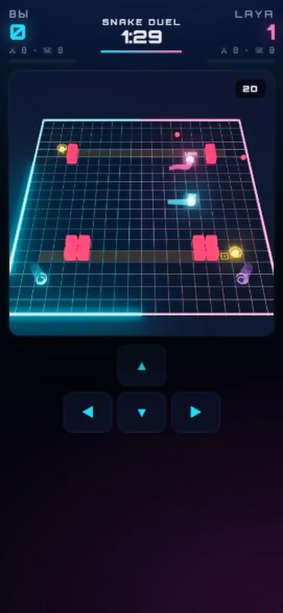 |

---

## 10. Турнир: наша v10 против настоящей Laya 421M

А как поведет себя оригинальная Laya от Convai Innovations (ModernBERT-large на 421M параметров)? Я взял оригинальные веса и провел очное сравнение:

| Модель | Параметры | Обычные ходы | Уклонения | Средняя партия | Очки за игру |
|---|---|---|---|---|---|
| **Laya «из коробки» (zero-shot)** | 421M | 77,9% | 37,1% | 165 ходов | **0,2** |
| **ModernBERT-base (1 эпоха)** | 149M | 90,0% | 54,1% | 116 ходов | 3,6 |
| **Наша v10 (DAgger, 10 итераций)** | 149M | 92,8% | 63,5% | 127 ходов | 5,0 |
| **Laya 421M (дообученная 1 эпоху)** | **421M** | **93,9%** | **67,6%** | **131 ход** | **6,0** |
| **Учитель (A* + симуляция)** | Алгоритм | 100% | 100% | 268 ходов | **12,3** |

Обратите внимание на первую строчку: оригинальная Laya 421M без единой итерации дообучения, получив лишь текстовый промпт *«выбери самый безопасный ход к еде»*, **прожила дольше всех обученных моделей (165 ходов) — и набрала жалкие 0,2 очка!** Модель полностью проигнорировала еду и в панике кружила по безопасным углам. Если бы метрикой было только время выживания, эта сверхосторожная змейка выглядела бы чемпионом!

Затем мы столкнули нашу **v10 (149M)** и **Laya 421M** в турнире из 20 матчей со сменой сторон. Итог: **16:4 в пользу Laya 421M**. Большая модель лучше уворачивалась от дронов, но её вес в браузере составляет 233 МБ вместо 71 МБ, а инференс занимает 330 мс вместо 120 мс.

---

## 11. Урок 5. Ищите, где модель реально проигрывает

Окрыленный успехом эгоцентрического окна 11×11, я решил научить змейку стратегическому планированию сбора яблок: обычное (+1), золотое (+3), звезда бессмертия (+2). Я разработал версии *v12* и *v13*, скормив модели приоритеты яблок и запустив новый цикл DAgger.

Результат: **ноль прироста**. Метрики застыли в пределах статистического шума.

Тогда я разложил статистику поражений:
* За каждый прожитый ход модель зарабатывала **столько же или даже больше очков, чем учитель** (0,109 очка/ход против 0,094 у алгоритма!). Модель прекрасно понимала ценность яблок!
* Проблема была в другом: учитель жил 236 ходов, а модель — 145 ходов. И в **70% партий её убивал дрон**!

Я потратил две недели на оптимизацию сбора яблок, когда узким местом были дроны. **Главный урок:** разложите метрику на множители перед тем, как браться за оптимизацию.

---

## 12. Интуиция и проверка: спасительный «Щит»

Как научить трансформер не залетать в смертельные ловушки? Мы обратились к архитектуре **AlphaGo / AlphaZero**: нейросеть дает быструю интуитивную оценку вариантов, а детерминированный поиск проверяет ход вперед.

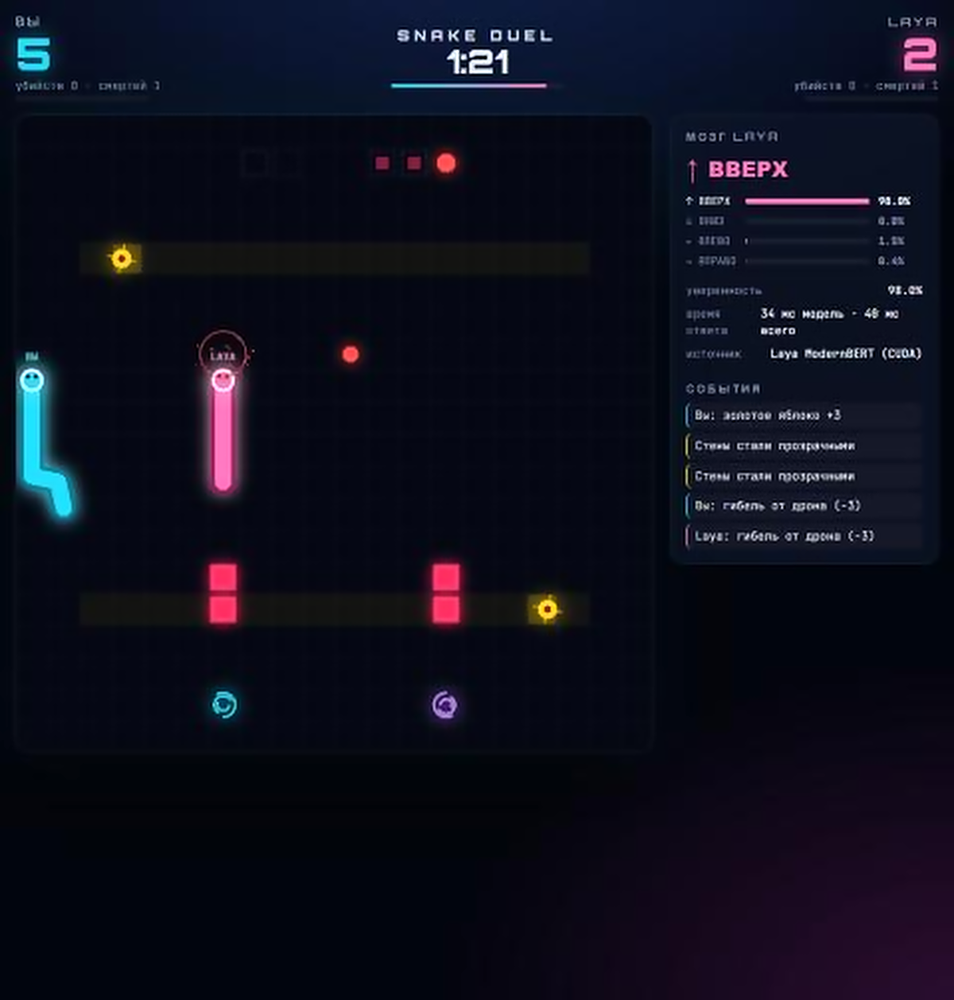

Принцип работы **Safety Shield**:
1. Трансформер ранжирует 4 возможных хода по вероятностям;
2. Микро-симулятор прокручивает лучший ход на **до 20 шагов вперед**, учитывая геометрию тела змейки, стены и траектории дронов;
3. Если после выбранного хода гарантированная гибель неизбежна — щит накладывает вето и берет второй по приоритету ход нейросети.

Потрясающий факт: **Щит вмешивается и меняет выбор нейросети всего в ~3,1% случаев!** В остальных 96,9% ходов он полностью соглашается с моделью. Но эти 3 процента кардинально изменили картину:

| Конфигурация (100 партий, 20×20) | Средний счёт | Ходов прожито | Дожили до финала (600) | Гибель от дронов |
|---|---|---|---|---|
| **Laya v11w (чистая нейросеть)** | 15,8 | 145 | 17% | 70% |
| **v11w + Щит на 4 хода** | 18,4 | 168 | 23% | 72% |
| **v11w + Щит на 20 ходов** | **23,1** | **257** | **75%** | **24%** |
| **Алгоритмический Учитель (A*)** | 22,1 | 236 | 55% | 44% |

Тандем нейросети и симулятора на 20 ходов **превзошел учителя**: 23,1 очка против 22,1 и выживаемость 75% против 55%!

---

## 13. Неудобная правда: почему алгоритм лучше

А теперь взглянем на цифры задержки без маркетингового тумана:

| Исполнитель | Среда исполнения | Время на ход | Потребление ресурсов |
|---|---|---|---|
| **Классический поиск пути (BFS)** | **Браузер, CPU JS** | **~0,3 мс** | **0 МБ памяти, 0 GPU** |
| **Laya 149M (PyTorch)** | Сервер, Nvidia GPU | ~40 мс | VRAM, серверный стек |
| **Laya INT4 WebGPU** | Браузер, WebGPU | ~120 мс | 71 МБ весов, нагрузка GPU |
| **Облачный Jev-1.13 API** | Интернет / API | ~400–1000 мс | Плата за токен, сетевой лаг |

Алгоритм на графах работает **в 400 раз быстрее нейросети на WebGPU**, не ошибается, не требует гигабайтов обучающих данных и занимает 100 строк чистого кода.

### Чек-лист: когда оправдана языковая модель решений?
1. **Правила невозможно или запредельно дорого описать кодом**, но есть массив примеров действий эксперта;
2. **Среда и правила постоянно меняются**, и переобучить модель на новых данных дешевле, чем переписывать тысячи условий `if/else`;
3. **Входные данные — полуструктурированный естественный язык** или разношерстный JSON;
4. **Задержка в 100 мс и редкие вероятностные ошибки допустимы** спецификой предметной области.

В задаче классической «Змейки» не выполняется ни одно из этих условий. Но именно благодаря своей компактности и прозрачности эта игра позволила вскрыть все скрытые подводные камни современных моделей принятия решений.

---

## 14. Ссылки на онлайн-игру и репозиторий

* **Jev** и **Laya** — многообещающее направление System 1 reasoning, но не серебряная пуля;
* **Формат входа — это часть весов:** малейшее расхождение схемы сериализации уничтожает инференс;
* **Без эгоцентрического окна** трансформеры не способны к пространственной генерализации;
* **Гибрид «интуиция нейросети + симуляторный щит»** бьет и чистую модель, и чисто эвристический поиск.

🎮 **Сыграть прямо в браузере (онлайн, WebGPU / WASM без сервера):**
* **3D-Дуэль против нейросети:** [https://marlogg74mp.github.io/snake-laya/](https://marlogg74mp.github.io/snake-laya/)
* **Одиночный режим 3D-арены:** [https://marlogg74mp.github.io/snake-laya/solo/](https://marlogg74mp.github.io/snake-laya/solo/)

💻 **Исходный код, пошаговые ветки (stage 1–5) и скрипты обучения:**
* **GitHub репозиторий проекта:** [https://github.com/marlogg74mp/snake-laya](https://github.com/marlogg74mp/snake-laya)

*(Модель весом 71 МБ скачивается в браузер один раз и считается локально на вашей видеокарте).*
